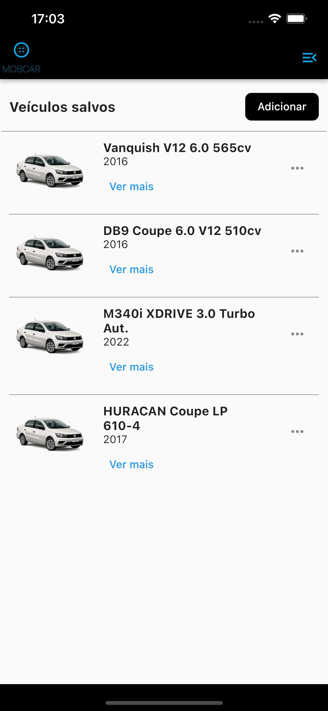
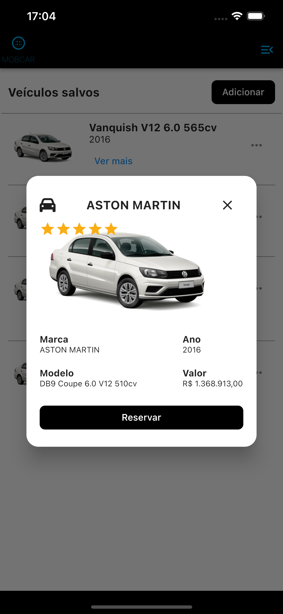
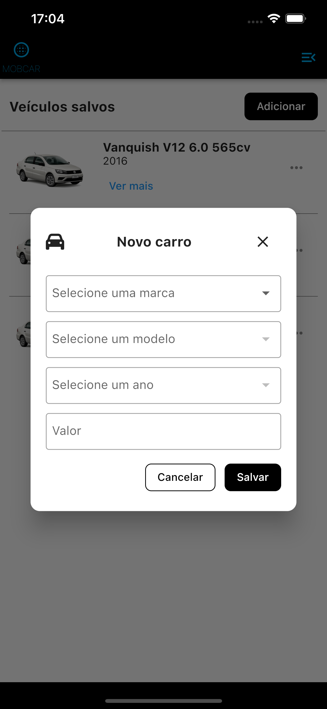
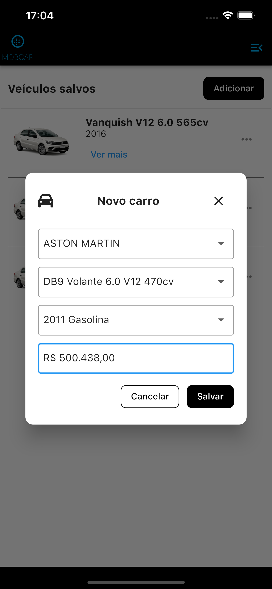

# MOBCAR

Trata-se de um aplicativo desenvolvido em FLUTTER, onde o mesmo realiza cadastro de veículos com dados da api FIPE API HTTP REST com documentação disponível no link (https://deividfortuna.github.io/fipe/), sendo possível visualizar marcas, modelos, e valores fipe de carros.

## Fluxo do aplicativo

  

## Dependências do aplicativo

<ul> 
    <li>http</li>
    <li>flutter_mobx</li>
    <li>mobx</li>
    <li>font_awesome_flutter</li>
    <li>shared_preferences</li>
    <li>get_it</li>
    <li>mobx_codegen</li>
    <li>build_runner</li>
</ul>
